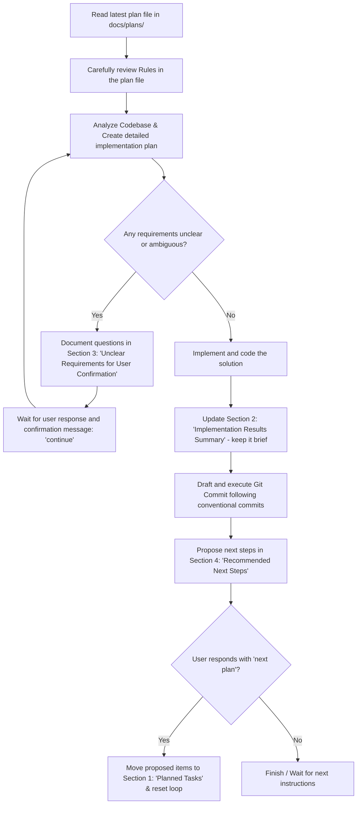

# 🚀 Plan-Driven Development Workflow

This document defines the standard operating procedure for agents when executing programming tasks driven by plan documents located in the `docs/plans/` directory.

---

## 🔄 Detailed Workflow



### Step 1: Initialize & Research
- **Read the Plan:** Go to the `docs/plans/` folder and read the active plan file (e.g., `20260807_plan.md`).
- **Read the Rules:** Always read the `## Rules` section at the end of the plan to catch file update instructions or specific coding constraints.
- **Analyze Codebase:** If the plan relates to a specific app, first check `docs/codebase_map.md` (e.g., `src/wind_management/docs/codebase_map.md`) to understand the layout, then use search tools (`grep_search`, `view_file`) to pinpoint targets.

### Step 2: Confirm Requirements
- **If everything is clear:** List the precise files to be modified and start implementing.
- **If there are ambiguities:** 
  1. Write detailed questions in `## 3. Unclear Requirements for User Confirmation` in the plan file.
  2. Report to the user and halt execution.
  3. Once the user provides clarification and commands **`continue`**, resume codebase analysis and plan implementation.

### Step 3: Implement & Update Status
- Implement changes matching the approved scope.
- Compile and build frontend assets (if React code is changed) and verify runtime functionality.
- Once complete, update `## 2. Implementation Results Summary` in the plan file. 
  *Note: Keep it highly concise using bullet points, listing only what was actually completed.*

### Step 4: Git Commit
- Review diff changes to ensure code cleanliness.
- Write down a draft commit message matching the conventional commits standard (e.g., `feat: ...`, `fix: ...`, `docs: ...`).
- Propose the commit message to the user, run commit upon approval.

### Step 5: Propose Next Steps (Next Plan Loop)
- List suggested features or follow-ups in `## 4. Recommended Next Steps`.
- Wait for user feedback:
  - If the user commands **`next plan`**: 
    1. Move agreed follow-ups into `## 1. Planned Tasks`.
    2. Reset/clear sections `## 2`, `## 3`, and `## 4` to prepare for the next iteration.
    3. Restart workflow from Step 1.

---

## ⚠️ Plan File Update Rules
- **Sections 1 & 2:** Append/insert new contents. Do not overwrite or delete history unless explicitly requested to preserve progress tracking.
- **Sections 3 & 4:** Overwrite/replace contents entirely during each cycle to keep it clean and relevant.

- **Frontend Sync (if React is updated):** 
  Always run build and static collection commands:
  ```bash
  npm run build (inside frontend/ directory)
  docker-compose exec django python manage.py collectstatic --noinput
  ```
