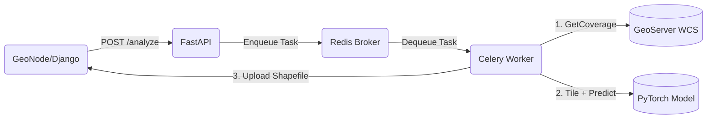

# GeoNode AI Mining Detection Service

A FastAPI & Celery-based webservice designed to integrate with GeoNode. It performs AI-powered mining detection on satellite imagery obtained from GeoServer (via WCS). The result is converted to a vector shapefile, smoothed, analyzed, and uploaded directly back to the GeoNode platform.

## 🏗 System Architecture

The service consists of 3 main components running asynchronously:
1. **FastAPI (`ai-api`)**: Receives analysis requests from GeoNode/users, enqueues them via Redis broker, and serves the job status and final results.
2. **Celery Worker (`ai-worker`)**: Picks up jobs, downloads WCS rasters, tiles the images, runs PyTorch inference, merges + smoothes masks, vectorizes the outputs, calculates spectral indices (NDVI, NDWI, BSI) over the detected areas, and finally uploads the generated shapefile to GeoNode.
3. **Redis (`redis-ai`)**: Acts as a message broker between FastAPI and Celery, and caches the job status & response.



## 📂 Project Structure

- `app/`: FastAPI web server, routes, Celery configuration, and Task orchestration.
- `core/`: Core AI & GIS algorithms (download, tiling, model loading, thresholding, morphology smoothing, vectorization, and statistical analysis).
- `models/`: Destination folder for `model.pt` (TorchScript format).
- `tests/`: Unit tests for APIs, schemas, and core algorithms.
- `docker-compose.ai.yml`: Docker stack to launch the AI components alongside your existing GeoNode network.

## 🚀 Quickstart

### 1. Prerequisites
- GeoNode currently running with network name `geonode_default` (check `docker network ls`).
- Placed your `model.pt` file inside the `models/` directory.

### 2. Configuration
All environment configs are in `.env.ai`. Make sure they align with your GeoNode deployments. Focus on:
- `GEOSERVER_URL`: Typically `http://geoserver:8080/geoserver/wcs`
- `GEONODE_UPLOAD_URL`: Generally `http://django:8000/api/v2/uploads/upload`
- `DEVICE`: `cpu` or `cuda`
- `WORK_DIR`: Default is `/tmp/ai-workdir` (this handles downloaded huge TIFs and created shapefiles).

### 3. Running Services
Start the server, worker, and Redis queue:
```bash
docker-compose -f docker-compose.ai.yml up --build -d
```
Check logs:
```bash
docker logs -f ai_api
docker logs -f ai_worker
```

## 📖 API Reference

### 1. POST `/analyze`
Initiates an async job.

**Headers:** `Content-Type: application/json`

**Body:**
```json
{
  "coverage_id": "geonode:sentinel2_hanoi_2024",
  "session_id": "YOUR_DJANGO_SESSION_ID_FOR_UPLOAD_AUTH",
  "bbox": [105.0, 20.0, 106.0, 21.0],
  "threshold": 0.57,
  "min_area_m2": 500,
  "tile_size": 512,
  "smooth": true,
  "closing_radius": 5,
  "simplify_tolerance": 10.0,
  "compute_spectral": true,
  "output_layer_name": "ai_mining_detected"
}
```

**Response (200 OK):**
```json
{
  "job_id": "3f721c5f-a316-43a0-beef-f0fbcca84ea5",
  "message": "Analysis job submitted"
}
```

### 2. GET `/status/{job_id}`
Polling endpoint to check job progress.

**Response (200 OK):**
```json
{
  "job_id": "3f721c5f-a316-43a0-beef-f0fbcca84ea5",
  "status": "PROCESSING",
  "progress": 60,
  "message": "Merging results...",
  "created_at": "2024-03-20T10:00:00Z",
  "updated_at": "2024-03-20T10:03:00Z"
}
```

### 3. GET `/result/{job_id}`
Fetch final statistics and uploaded URL.

**Response (200 OK):**
```json
{
  "job_id": "3f721c5f-a316-43a0-beef-f0fbcca84ea5",
  "status": "COMPLETED",
  "statistics": {
    "total_area_ha": 42.5,
    "count": 12,
    "max_area_ha": 15.2,
    "min_area_ha": 0.1,
    "avg_ndvi": -0.12,
    "avg_ndwi": -0.05,
    "avg_bsi": 0.15
  },
  "shapefile_url": "http://localhost/layer/geonode:ai_mining_detected",
  "created_at": "2024-03-20T10:00:00Z"
}
```
*(Returns 404 if job isn't ready or 500 if failed).*

## 🧪 Testing
Unit tests cover API integrations, schemas validation, and core downloads. They are written in Pytest.
Ensure dependencies are met by running first:
```bash
pip install -r requirements.txt
```
Execute the tests directly:
```bash
python -m pytest tests/ -v
```
