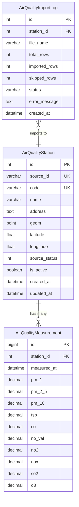
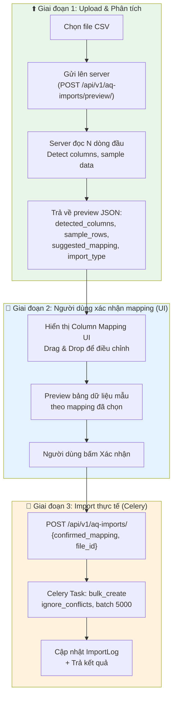

# 🏭 Thiết Kế Chức Năng: Module Quan Trắc Chất Lượng Không Khí (Station Air Quality)

## 📋 Mục Lục
1. [Tổng Quan & Mục Tiêu](#1-tổng-quan--mục-tiêu)
2. [Phân Tích Dữ Liệu Đầu Vào](#2-phân-tích-dữ-liệu-đầu-vào)
3. [Thiết Kế Cơ Sở Dữ Liệu (Models)](#3-thiết-kế-cơ-sở-dữ-liệu-models)
4. [Thiết Kế API Endpoints](#4-thiết-kế-api-endpoints)
5. [Thiết Kế ETL / Import Pipeline](#5-thiết-kế-etl--import-pipeline)
6. [Chức Năng Quản Lý (CRUD)](#6-chức-năng-quản-lý-crud)
7. [Chức Năng Truy Vấn & Lọc Dữ Liệu](#7-chức-năng-truy-vấn--lọc-dữ-liệu)
8. [Chức Năng Thống Kê & Phân Tích](#8-chức-năng-thống-kê--phân-tích)
9. [Thiết Kế Giao Diện (UI/Template Views)](#9-thiết-kế-giao-diện-uitemplate-views)
10. [Kế Hoạch Triển Khai](#10-kế-hoạch-triển-khai)

---

## 1. Tổng Quan & Mục Tiêu

### 1.1 Bối cảnh
Module `co2_management` hiện tại quản lý dữ liệu nồng độ CO2 từ **vệ tinh** (OCO-2, GOSAT-2). Yêu cầu mới là tích hợp thêm nguồn dữ liệu **mặt đất** — dữ liệu quan trắc chất lượng không khí từ mạng lưới trạm quan trắc tự động trên toàn quốc.

### 1.2 Mục tiêu
- **Quản lý trạm quan trắc**: CRUD thông tin trạm, hiển thị vị trí trên bản đồ
- **Nhập dữ liệu đo đạc**: Import hàng loạt từ file CSV, hỗ trợ nhiều cấu trúc cột khác nhau
- **Truy vấn linh hoạt**: Lọc theo trạm, khoảng thời gian, thông số ô nhiễm, ngưỡng giá trị
- **Thống kê & phân tích**: Tổng hợp theo giờ/ngày/tháng, so sánh giữa các trạm, phát hiện vượt ngưỡng
- **Tích hợp CO2**: Khả năng đối chiếu dữ liệu mặt đất với dữ liệu vệ tinh CO2 hiện có

### 1.3 Phạm vi
Chỉ xử lý **thông số ô nhiễm không khí** (bụi, khí). Loại bỏ hoàn toàn các thông số khí tượng (nhiệt độ, độ ẩm, hướng gió, tốc độ gió, bức xạ, lượng mưa, áp suất).

---

## 2. Phân Tích Dữ Liệu Đầu Vào

### 2.1 Tổng quan nguồn dữ liệu

| Thuộc tính | Chi tiết |
|---|---|
| **Số trạm (file danh mục)** | ~121 trạm trên toàn quốc |
| **File dữ liệu mẫu** | 10 file CSV (mỗi file ~5,300 – 8,600 bản ghi) |
| **Tần suất đo** | Mỗi giờ (hourly) |
| **Khoảng thời gian** | Khoảng 12 tháng dữ liệu liên tục |
| **Vùng địa lý** | Chủ yếu Quảng Ninh + một số tỉnh thành khác |

### 2.2 Cấu trúc file danh mục trạm (`Du_lieu_Tram_Full.csv`)

| Cột CSV | Mô tả | Ví dụ |
|---|---|---|
| `stationId` | Mã định danh duy nhất (chuỗi số dài) | `29518862280522648049760863667` |
| `stationCode` | Mã rút gọn | `QN_TNMT_KHIHHA` |
| `stationName` | Tên hiển thị | `Quảng Ninh: UBND huyện Hải Hà (KK)` |
| `createdAt` | Ngày tạo trên hệ thống nguồn | `2024-04-09T15:45:41` |
| `address` | Địa chỉ lắp đặt | Text dài |
| `latitude` | Vĩ độ | `21.3385` |
| `longtitude` | Kinh độ (lưu ý: typo gốc `longtitude`) | `105.367` |
| `status` | Trạng thái (0 = bình thường, 4 = bảo trì/offline) | `0` |

### 2.3 Cấu trúc file đo đạc (đa dạng cột)

Mỗi trạm có **tập cột khác nhau** tùy theo thiết bị được trang bị. Sau khi loại bỏ cột khí tượng, tập hợp **10 thông số ô nhiễm cốt lõi** gồm:

| Nhóm | Thông số | Đơn vị (tiêu chuẩn) |
|---|---|---|
| **Bụi** | `PM-1`, `PM-2.5` (hoặc `PM-2-5`), `PM-10`, `TSP` | µg/m³ |
| **Khí** | `CO`, `NO`, `NO2`, `NOx`, `SO2`, `O3` | µg/m³ |

**Ma trận có/không theo trạm mẫu:**

| Trạm | PM-1 | PM-2.5 | PM-10 | TSP | CO | NO | NO2 | NOx | SO2 | O3 |
|---|:---:|:---:|:---:|:---:|:---:|:---:|:---:|:---:|:---:|:---:|
| `QN_TNMT_KHIHHA` | ❌ | ❌ | ❌ | ✅ | ✅ | ✅ | ✅ | ✅ | ✅ | ✅ |
| `KHCH_KHIXQU` | ✅ | ✅ | ✅ | ✅ | ❌ | ✅ | ✅ | ✅ | ✅ | ✅ |
| `QN_CAXA_KHIXQU` | ✅ | ✅ | ✅ | ✅ | ✅ | ✅ | ✅ | ✅ | ✅ | ✅ |
| `UOBI_KHIXQU` | ✅ | ✅ | ✅ | ✅ | ✅ | ✅ | ✅ | ✅ | ✅ | ✅ |

> **LƯU Ý QUAN TRỌNG:** Cấu trúc cột giữa các file KHÔNG đồng nhất. Hệ thống import cần **tự động phát hiện** cột nào tồn tại và map đúng vào trường tương ứng, cột vắng mặt sẽ lưu `NULL`.

### 2.4 Cột khí tượng bị loại bỏ

Các cột sau sẽ **KHÔNG** được import vào database:
`Tốc độ gió`, `Hướng gió`, `RH` (Độ ẩm), `Nhiệt độ`, `Áp suất khí quyển`, `Compass`, `Radiation`, `Lượng mưa`, `Rain density`

---

## 3. Thiết Kế Cơ Sở Dữ Liệu (Models)

### 3.1 Sơ đồ quan hệ (ER Diagram)



> **Quyết định thiết kế:** Bảng `AirQualityStationStats` **không** được lưu vào database. Mọi thống kê (min, max, avg, count theo ngày/tháng/năm) sẽ được tính toán **on-the-fly** tại thời điểm truy vấn thông qua Django ORM aggregation (`Avg`, `Min`, `Max`, `Count`). Điều này đơn giản hóa kiến trúc và luôn đảm bảo dữ liệu thống kê phản ánh đúng dataset hiện tại mà không cần đồng bộ hóa.

### 3.2 Model Django chi tiết

#### 3.2.1 `AirQualityStation` — Thông tin trạm quan trắc

```python
class StationStatus(models.IntegerChoices):
    """Trạng thái hoạt động của trạm từ hệ thống nguồn"""
    NORMAL = 0, 'Hoạt động bình thường'
    MAINTENANCE = 4, 'Bảo trì / Offline'

class AirQualityStation(models.Model):
    """
    Lưu trữ thông tin danh mục tĩnh của các trạm quan trắc chất lượng không khí.
    Mapping: Bảng `stations` trong database design.
    """
    source_id = models.CharField(
        max_length=255, unique=True,
        help_text="Mã định danh hệ thống nguồn (stationId trong file CSV)"
    )
    code = models.CharField(
        max_length=50, unique=True,
        help_text="Mã trạm rút gọn (stationCode, VD: QN_TNMT_KHIHHA)"
    )
    name = models.CharField(max_length=255, help_text="Tên hiển thị của trạm")
    address = models.TextField(null=True, blank=True, help_text="Địa chỉ đặt trạm")
    geom = models.PointField(srid=4326, null=True, blank=True, help_text="Vị trí không gian PostGIS")
    latitude = models.FloatField(null=True, blank=True)
    longitude = models.FloatField(null=True, blank=True)
    source_status = models.IntegerField(
        choices=StationStatus.choices, default=StationStatus.NORMAL,
        help_text="Trạng thái từ hệ thống nguồn"
    )
    is_active = models.BooleanField(default=True, help_text="Trạng thái hoạt động nội bộ")
    created_at = models.DateTimeField(auto_now_add=True)
    updated_at = models.DateTimeField(auto_now=True)

    class Meta:
        db_table = 'co2_airquality_station'
        ordering = ['code']
        verbose_name = 'Trạm quan trắc không khí'
        verbose_name_plural = 'Trạm quan trắc không khí'

    def save(self, *args, **kwargs):
        """Tự động đồng bộ geom từ latitude/longitude"""
        if self.latitude is not None and self.longitude is not None:
            self.geom = Point(self.longitude, self.latitude, srid=4326)
        super().save(*args, **kwargs)

    def __str__(self):
        return f"[{self.code}] {self.name}"
```

#### 3.2.2 `AirQualityMeasurement` — Dữ liệu đo đạc

```python
class AirQualityMeasurement(models.Model):
    """
    Lưu trữ chuỗi thời gian đo đạc chất lượng không khí theo mô hình Wide Table.
    Các trường có thể NULL nếu trạm không được trang bị cảm biến tương ứng.
    Mapping: Bảng `station_measurements` trong database design.
    """
    id = models.BigAutoField(primary_key=True)
    station = models.ForeignKey(
        AirQualityStation, on_delete=models.CASCADE,
        related_name='measurements',
        help_text="Trạm thực hiện phép đo"
    )
    measured_at = models.DateTimeField(
        help_text="Thời điểm đo (getTime trong file CSV)"
    )

    # --- Nhóm Bụi (Particulate Matter) ---
    pm_1 = models.DecimalField(
        max_digits=10, decimal_places=4, null=True, blank=True,
        help_text="Nồng độ bụi PM1 (µg/m³)"
    )
    pm_2_5 = models.DecimalField(
        max_digits=10, decimal_places=4, null=True, blank=True,
        help_text="Nồng độ bụi PM2.5 (µg/m³)"
    )
    pm_10 = models.DecimalField(
        max_digits=10, decimal_places=4, null=True, blank=True,
        help_text="Nồng độ bụi PM10 (µg/m³)"
    )
    tsp = models.DecimalField(
        max_digits=10, decimal_places=4, null=True, blank=True,
        help_text="Nồng độ tổng bụi lơ lửng TSP (µg/m³)"
    )

    # --- Nhóm Khí (Gaseous Pollutants) ---
    co = models.DecimalField(
        max_digits=10, decimal_places=4, null=True, blank=True,
        help_text="Khí Carbon Monoxide (µg/m³)"
    )
    no_val = models.DecimalField(
        max_digits=10, decimal_places=4, null=True, blank=True,
        db_column='no',
        help_text="Khí Nitric Oxide (µg/m³). Dùng 'no_val' vì 'no' là reserved keyword."
    )
    no2 = models.DecimalField(
        max_digits=10, decimal_places=4, null=True, blank=True,
        help_text="Khí Nitrogen Dioxide (µg/m³)"
    )
    nox = models.DecimalField(
        max_digits=10, decimal_places=4, null=True, blank=True,
        help_text="Tổng Nitrogen Oxides (µg/m³)"
    )
    so2 = models.DecimalField(
        max_digits=10, decimal_places=4, null=True, blank=True,
        help_text="Khí Sulfur Dioxide (µg/m³)"
    )
    o3 = models.DecimalField(
        max_digits=10, decimal_places=4, null=True, blank=True,
        help_text="Khí Ozone (µg/m³)"
    )

    class Meta:
        db_table = 'co2_airquality_measurement'
        indexes = [
            models.Index(
                fields=['station', 'measured_at'],
                name='idx_aq_station_time'
            ),
            models.Index(
                fields=['measured_at'],
                name='idx_aq_measured_at'
            ),
        ]
        constraints = [
            models.UniqueConstraint(
                fields=['station', 'measured_at'],
                name='uq_aq_station_measured_at'
            ),
        ]
        ordering = ['-measured_at']
        verbose_name = 'Phép đo chất lượng không khí'
        verbose_name_plural = 'Phép đo chất lượng không khí'

    def __str__(self):
        return f"{self.station.code} @ {self.measured_at}"
```

#### 3.2.3 Ghi chú: Không có bảng Stats riêng

Thống kê sẽ được tính toán **on-the-fly** qua Django ORM aggregation. Ví dụ:

```python
# Trong AirQualityStatisticsViewSet — tính tổng hợp theo ngày, không cần bảng trung gian
from django.db.models import Avg, Min, Max, Count
from django.db.models.functions import TruncDay, TruncMonth

# Thống kê theo ngày cho 1 trạm
AirQualityMeasurement.objects.filter(
    station_id=station_id,
    measured_at__date__range=[date_from, date_to]
).annotate(
    period=TruncDay('measured_at')
).values('period').annotate(
    avg_pm25=Avg('pm_2_5'),
    min_pm25=Min('pm_2_5'),
    max_pm25=Max('pm_2_5'),
    count=Count('id'),
).order_by('period')

# Ưu điểm:
# - Không cần sync/cache, luôn phản ánh dữ liệu mới nhất
# - Không tốn disk cho bảng pre-computed
# - Giảm độ phức tạp migration
# Nhược điểm (chấp nhận được với ~70k records):
# - Query chậm hơn khi dữ liệu rất lớn (>1M rows)
# - Có thể thêm index bổ sung nếu cần
```

#### 3.2.4 `AirQualityImportLog` — Nhật ký Import

```python
class ImportStatus(models.TextChoices):
    """Trạng thái của một lần import"""
    PENDING = 'PENDING', 'Đang chờ'
    RUNNING = 'RUNNING', 'Đang xử lý'
    COMPLETED = 'COMPLETED', 'Hoàn thành'
    PARTIAL = 'PARTIAL', 'Hoàn thành một phần'
    FAILED = 'FAILED', 'Thất bại'

class AirQualityImportLog(models.Model):
    """
    Ghi lại lịch sử mỗi lần nhập dữ liệu từ file CSV cho một trạm.
    """
    station = models.ForeignKey(
        AirQualityStation, on_delete=models.CASCADE,
        related_name='import_logs', null=True, blank=True,
        help_text="Trạm được import (có thể null nếu import batch nhiều trạm)"
    )
    file_name = models.CharField(max_length=500, help_text="Tên file CSV đã import")
    total_rows = models.IntegerField(default=0, help_text="Tổng số dòng trong file")
    imported_rows = models.IntegerField(default=0, help_text="Số dòng import thành công")
    skipped_rows = models.IntegerField(default=0, help_text="Số dòng bị bỏ qua (trùng lặp)")
    error_rows = models.IntegerField(default=0, help_text="Số dòng lỗi")
    status = models.CharField(
        max_length=20, choices=ImportStatus.choices, default=ImportStatus.PENDING
    )
    error_message = models.TextField(null=True, blank=True, help_text="Chi tiết lỗi nếu có")
    celery_task_id = models.CharField(max_length=255, null=True, blank=True)
    created_at = models.DateTimeField(auto_now_add=True)
    finished_at = models.DateTimeField(null=True, blank=True)

    class Meta:
        db_table = 'co2_airquality_import_log'
        ordering = ['-created_at']

    def __str__(self):
        return f"Import {self.file_name} ({self.status})"
```

### 3.3 Quy chuẩn giới hạn ô nhiễm (QCVN 05:2023/BTNMT)

Bảng hằng số ngưỡng phục vụ cho chức năng cảnh báo và thống kê vượt ngưỡng:

```python
# constants.py
AQ_THRESHOLDS = {
    # Trung bình 1 giờ (µg/m³)
    'hourly': {
        'pm_2_5': None,    # QCVN không quy định trung bình 1h cho PM2.5
        'pm_10': None,
        'tsp': 300,
        'co': 30000,
        'no2': 200,
        'so2': 350,
        'o3': 200,
    },
    # Trung bình 24 giờ (µg/m³)
    'daily': {
        'pm_2_5': 50,
        'pm_10': 150,
        'tsp': 200,
        'co': 10000,
        'no2': 100,
        'so2': 125,
        'o3': 120,
    },
    # Trung bình năm (µg/m³)
    'yearly': {
        'pm_2_5': 25,
        'pm_10': 50,
        'tsp': 100,
        'no2': 40,
        'so2': 50,
    },
}

# Mapping tên cột CSV → tên field model
CSV_COLUMN_MAP = {
    'PM-1': 'pm_1',
    'PM-2-5': 'pm_2_5',
    'PM-2.5': 'pm_2_5',
    'PM-10': 'pm_10',
    'TSP': 'tsp',
    'CO': 'co',
    'NO': 'no_val',
    'NO2': 'no2',
    'NOx': 'nox',
    'SO2': 'so2',
    'O3': 'o3',
}

# Cột khí tượng cần bỏ qua khi import
METEOROLOGICAL_COLUMNS = {
    'Tốc độ gió', 'Hướng gió', 'RH', 'Nhiệt độ',
    'Áp suất khí quyển', 'Compass', 'Radiation',
    'Lượng mưa', 'Rain density',
}
```

---

## 4. Thiết Kế API Endpoints

### 4.1 Tổng quan URL Routing

Tất cả endpoints mới được đăng ký dưới prefix `/co2/api/v1/` (cùng router hiện tại):

| Route | ViewSet | HTTP Methods | Mô tả |
|---|---|---|---|
| `api/v1/aq-stations/` | `StationViewSet` | GET, POST, PUT, DELETE | CRUD trạm quan trắc |
| `api/v1/aq-stations/{id}/measurements/` | nested action | GET | Xem dữ liệu đo đạc theo trạm |
| `api/v1/aq-stations/{id}/stats/` | nested action | GET | Xem thống kê theo trạm |
| `api/v1/aq-stations/map/` | custom action | GET | Dữ liệu GeoJSON cho bản đồ (`GeoFeatureModelSerializer`) |
| `api/v1/aq-stations/import_csv/` | custom action | POST | Import danh mục trạm từ tệp CSV |
| `api/v1/aq-stations/download_template/` | custom action | GET | Tải xuống tệp CSV mẫu nhập danh mục trạm |
| `api/v1/aq-measurements/` | `StationMeasurementViewSet` | GET | Truy vấn dữ liệu đo đạc (toàn bộ trạm) |
| `api/v1/aq-measurements/latest/` | custom action | GET | Giá trị mới nhất mỗi trạm |
| `api/v1/aq-measurements/export/` | custom action | GET | Xuất CSV |
| `api/v1/aq-statistics/` | `StationStatisticsViewSet` | GET | Thống kê tổng hợp |
| `api/v1/aq-statistics/comparison/` | custom action | GET | So sánh giữa các trạm |
| `api/v1/aq-statistics/threshold-violations/` | custom action | GET | Thống kê vượt ngưỡng |
| `api/v1/aq-statistics/trends/` | custom action | GET | Phân tích xu hướng |

### 4.2 Chi tiết các API quan trọng

#### 4.2.1 `GET /api/v1/aq-stations/` — Danh sách trạm

**Query Parameters:**
| Param | Type | Mô tả |
|---|---|---|
| `search` | string | Tìm kiếm theo tên/mã trạm |
| `is_active` | boolean | Lọc theo trạng thái hoạt động |
| `has_data` | boolean | Chỉ trạm có dữ liệu đo đạc |
| `bbox` | string | Bounding box `min_lon,min_lat,max_lon,max_lat` |

**Response (200):**
```json
{
    "count": 121,
    "results": [
        {
            "id": "28505268571336961948594948504",
            "code": "PT_VTRI_KHIVTR",
            "name": "Phú Thọ: đường Hùng Vương - Tp Việt Trì (KK)",
            "address": "Khuôn viên của Công ty xăng dầu Phú Thọ...",
            "latitude": "21.338500",
            "longitude": "105.367000",
            "status": 0,
            "created_at": "2026-07-24T02:47:16.123743Z",
            "measurement_count": 8520,
            "latest_measurement_at": "2025-03-25T23:00:00Z",
            "available_pollutants": ["tsp", "co", "no2", "nox", "so2", "o3"]
        }
    ]
}
```

#### 4.2.1b `POST /api/v1/aq-stations/import_csv/` — Import danh mục trạm từ tệp CSV

**Request (multipart/form-data):**
| Field | Type | Bắt buộc | Mô tả |
|---|---|---|---|
| `file` | File | ✅ | Tệp CSV chứa danh mục trạm theo đúng cấu trúc tệp mẫu |

**Validation Rules:**
- Kiểm tra nghiêm ngặt sự tồn tại của các cột bắt buộc: `stationId`, `stationName`.
- Kiểm tra kiểu dữ liệu của từng dòng: `latitude` & `longitude` (float), `status` (integer).
- Nếu không đúng tiêu chuẩn, trả về lỗi HTTP 400 Bad Request kèm chi tiết lý do.

**Response Success (200 OK):**
```json
{
    "success": true,
    "total_rows": 121,
    "created_count": 121,
    "updated_count": 0,
    "error_count": 0,
    "errors": []
}
```

**Response Error (400 Bad Request):**
```json
{
    "success": false,
    "error": "File CSV không đúng định dạng mẫu. Thiếu các cột bắt buộc: stationId, stationName. Các cột chuẩn gồm: stationId, stationCode, stationName, address, latitude, longitude, status."
}
```

#### 4.2.1c `GET /api/v1/aq-stations/download_template/` — Tải xuống file CSV mẫu nhập danh mục trạm

**Response (200 OK):**
- Content-Type: `text/csv; charset=utf-8`
- Header: `Content-Disposition: attachment; filename="mau_import_tram_quan_trac.csv"`
- Mã hóa: UTF-8 BOM (`\ufeff`) hỗ trợ hiển thị tiếng Việt trên Microsoft Excel.

Cấu trúc nội dung tệp mẫu:
```csv
stationId,stationCode,stationName,address,latitude,longitude,status
28505268571336961948594948504,PT_VTRI_KHIVTR,Phú Thọ: đường Hùng Vương - Tp Việt Trì (KK),"Khuôn viên của Công ty xăng dầu Phú Thọ tại đường Hùng Vương, thành phố Việt Trì",21.3385,105.367,0
28505272740301122608933325208,LEDU_KHIDNA,Đà Nẵng: 41 đường Lê Duẩn (KK),"Khuôn viên của Trường Đại học Đà Nẵng, số 41 – Lê Duẩn",16.074,108.215,0
```

#### 4.2.2 `GET /api/v1/aq-stations/map/` — GeoJSON cho bản đồ

Sử dụng `GeoFeatureModelSerializer` từ `rest_framework_gis` kết hợpPostGIS `geom`.

**Response (200):**
```json
{
    "type": "FeatureCollection",
    "features": [
        {
            "id": "28505268571336961948594948504",
            "type": "Feature",
            "geometry": {"type": "Point", "coordinates": [105.367, 21.3385]},
            "properties": {
                "code": "PT_VTRI_KHIVTR",
                "name": "Phú Thọ: đường Hùng Vương - Tp Việt Trì (KK)",
                "address": "Khuôn viên của Công ty xăng dầu Phú Thọ...",
                "status": 0,
                "latest_pm_2_5": 23.5,
                "latest_no2": 12.3,
                "latest_measured_at": "2025-03-25T23:00:00Z"
            }
        }
    ]
}
```

#### 4.2.3 `GET /api/v1/aq-measurements/` — Truy vấn dữ liệu đo đạc

**Query Parameters:**
| Param | Type | Bắt buộc | Mô tả |
|---|---|---|---|
| `station_id` | int/list | ❌ | ID trạm (hỗ trợ nhiều giá trị: `1,2,3`) |
| `station_code` | string | ❌ | Mã trạm |
| `date_from` | datetime | ❌ | Thời điểm bắt đầu (ISO 8601) |
| `date_to` | datetime | ❌ | Thời điểm kết thúc (ISO 8601) |
| `pollutant` | string | ❌ | Lọc thông số: `pm_1,pm_2_5,pm_10,tsp,co,no,no2,nox,so2,o3` |
| `min_value` | float | ❌ | Ngưỡng giá trị tối thiểu (cho pollutant chỉ định) |
| `max_value` | float | ❌ | Ngưỡng giá trị tối đa |
| `page` | int | ❌ | Trang (pagination) |
| `page_size` | int | ❌ | Số bản ghi/trang (mặc định 100, tối đa 1000) |
| `ordering` | string | ❌ | Sắp xếp: `measured_at`, `-measured_at` |

**Response (200):**
```json
{
    "count": 8520,
    "next": "...?page=2",
    "results": [
        {
            "id": 1,
            "station_id": 1,
            "station_code": "QN_TNMT_KHIHHA",
            "measured_at": "2025-01-01T23:00:00Z",
            "pm_1": null,
            "pm_2_5": null,
            "pm_10": null,
            "tsp": 0.2586,
            "co": 2158.883,
            "no_val": null,
            "no2": 6.0914,
            "nox": 3.1022,
            "so2": 2.7421,
            "o3": 89.5271
        }
    ]
}
```

#### 4.2.4 `GET /api/v1/aq-measurements/latest/` — Giá trị mới nhất mỗi trạm

Trả về phép đo gần nhất của mỗi trạm đang hoạt động. Dùng cho dashboard tổng quan.

**Response (200):**
```json
[
    {
        "station_id": 1,
        "station_code": "QN_TNMT_KHIHHA",
        "station_name": "Quảng Ninh: UBND huyện Hải Hà (KK)",
        "measured_at": "2025-03-25T23:00:00Z",
        "pm_2_5": null,
        "pm_10": null,
        "tsp": 6.14,
        "co": 1866.42,
        "no2": 28.96,
        "so2": 8.67,
        "o3": 116.91
    }
]
```

#### 4.2.4b `POST /api/v1/aq-measurements/import_csv/` — Import dữ liệu đo đạc theo trạm từ tệp CSV

**Request (multipart/form-data):**
| Field | Type | Bắt buộc | Mô tả |
|---|---|---|---|
| `file` | File | ✅ | Tệp CSV chứa chuỗi dữ liệu đo đạc chất lượng không khí của trạm |
| `station_id` | string | ❌ | Mã trạm mặc định (nếu file CSV không chứa cột `stationId`/`stationCode`) |

**Đặc điểm xử lý:**
- Tự động nhận diện cột thời gian đo: `getTime`, `measured_at`.
- Tự động ánh xạ các chỉ số ô nhiễm (`PM-1`, `PM-2.5`, `PM-10`, `TSP`, `CO`, `NO`, `NO2`, `NOx`, `SO2`, `O3`).
- Tự động bỏ qua các cột khí tượng (`Tốc độ gió`, `Hướng gió`, `Nhiệt độ`, `RH`...).
- Thực thi `update_or_create` theo cặp `(station, measured_at)` tránh trùng lặp dữ liệu.

**Response Success (200 OK):**
```json
{
    "success": true,
    "total_rows": 8520,
    "created_count": 8450,
    "updated_count": 70,
    "error_count": 0,
    "errors": []
}
```

#### 4.2.4c `GET /api/v1/aq-measurements/download_template/` — Tải xuống tệp CSV mẫu nhập dữ liệu đo đạc

**Response (200 OK):**
- Content-Type: `text/csv; charset=utf-8`
- Header: `Content-Disposition: attachment; filename="mau_import_do_dac_tram.csv"`
- Mã hóa: UTF-8 BOM (`\ufeff`) hỗ trợ hiển thị tiếng Việt trên Microsoft Excel.

Cấu trúc nội dung tệp mẫu:
```csv
stationId,stationCode,stationName,getTime,PM-1,PM-2.5,PM-10,TSP,CO,NO,NO2,NOx,SO2,O3
29518862280522648049760863667,QN_TNMT_KHIHHA,Quảng Ninh: UBND huyện Hải Hà (KK),2025-01-01T23:00:00,,,,0.2586,2158.883,,6.0914,3.1022,2.7421,89.5271
```

#### 4.2.5 `GET /api/v1/aq-statistics/comparison/` — So sánh giữa các trạm

**Query Parameters:**
| Param | Type | Bắt buộc | Mô tả |
|---|---|---|---|
| `station_ids` | list(int) | ✅ | Danh sách ID trạm cần so sánh (2-10) |
| `pollutant` | string | ✅ | Thông số cần so sánh |
| `date_from` | datetime | ✅ | Ngày bắt đầu |
| `date_to` | datetime | ✅ | Ngày kết thúc |
| `aggregation` | string | ❌ | `hourly` (mặc định), `daily`, `monthly` |

**Response (200):**
```json
{
    "pollutant": "pm_2_5",
    "aggregation": "daily",
    "stations": [
        {
            "station_id": 1,
            "station_code": "KHCH_KHIXQU",
            "station_name": "Quảng Ninh: VP C.ty than Khe Chàm",
            "data": [
                {"date": "2025-01-01", "avg": 3.34, "min": 2.1, "max": 5.8},
                {"date": "2025-01-02", "avg": 4.12, "min": 1.9, "max": 7.3}
            ],
            "summary": {"overall_avg": 3.73, "overall_min": 1.9, "overall_max": 7.3}
        },
        {
            "station_id": 2,
            "station_code": "UOBI_KHIXQU",
            "data": ["..."]
        }
    ]
}
```

#### 4.2.6 `GET /api/v1/aq-statistics/threshold-violations/` — Thống kê vượt ngưỡng

**Query Parameters:**
| Param | Type | Bắt buộc | Mô tả |
|---|---|---|---|
| `station_id` | int | ❌ | Lọc theo trạm (nếu không truyền → tất cả) |
| `date_from` | datetime | ✅ | Ngày bắt đầu |
| `date_to` | datetime | ✅ | Ngày kết thúc |
| `standard` | string | ❌ | `hourly` hoặc `daily` (mặc định: `daily`) |

**Response (200):**
```json
{
    "standard": "daily",
    "period": {"from": "2025-01-01", "to": "2025-03-25"},
    "violations": [
        {
            "station_id": 1,
            "station_code": "QN_TNMT_KHIHHA",
            "pollutant": "tsp",
            "threshold": 200,
            "violation_count": 3,
            "max_recorded": 312.5,
            "violation_dates": ["2025-01-15", "2025-02-03", "2025-03-11"]
        },
        {
            "station_id": 2,
            "station_code": "UOBI_KHIXQU",
            "pollutant": "pm_2_5",
            "threshold": 50,
            "violation_count": 12,
            "max_recorded": 89.2
        }
    ],
    "summary": {
        "total_violations": 15,
        "stations_with_violations": 2,
        "most_violated_pollutant": "pm_2_5"
    }
}
```

#### 4.2.7 `GET /api/v1/aq-statistics/trends/` — Phân tích xu hướng

**Query Parameters:**
| Param | Type | Bắt buộc | Mô tả |
|---|---|---|---|
| `station_id` | int | ✅ | ID trạm |
| `pollutant` | string | ✅ | Thông số phân tích |
| `date_from` | datetime | ✅ | |
| `date_to` | datetime | ✅ | |
| `granularity` | string | ❌ | `hourly`, `daily` (mặc định), `monthly` |

**Response (200):**
```json
{
    "station_code": "QN_TNMT_KHIHHA",
    "pollutant": "no2",
    "granularity": "daily",
    "trend": {
        "direction": "increasing",
        "slope": 0.023,
        "r_squared": 0.67,
        "description": "Xu hướng tăng nhẹ"
    },
    "data_points": [
        {"date": "2025-01-01", "avg": 8.5, "min": 3.2, "max": 15.1, "count": 24},
        {"date": "2025-01-02", "avg": 9.1, "min": 4.0, "max": 16.3, "count": 24}
    ]
}
```

#### 4.2.8 `POST /api/v1/aq-imports/preview/` — Phân tích file (Giai đoạn 1)

**Request (multipart/form-data):**
| Field | Type | Bắt buộc | Mô tả |
|---|---|---|---|
| `file` | File | ✅ | File CSV cần import |
| `import_type` | string | ❌ | `measurements` (mặc định) hoặc `stations` |

**Response (200):** Trả về preview JSON để render UI mapping — xem chi tiết tại [Mục 5.2](#52-giai-đoạn-1-upload--phân-tích-preview-endpoint).

#### 4.2.9 `POST /api/v1/aq-imports/` — Import thực tế (Giai đoạn 3)

**Request (application/json):**
| Field | Type | Bắt buộc | Mô tả |
|---|---|---|---|
| `file_id` | string | ✅ | ID file tạm nhận từ bước preview |
| `confirmed_mapping` | object | ✅ | Mapping `{csv_column: target_field}` đã xác nhận |
| `import_type` | string | ✅ | `stations` hoặc `measurements` |

**Response (201):**
```json
{
    "import_id": 42,
    "status": "PENDING",
    "message": "Import task đã được đưa vào hàng đợi",
    "task_id": "abc-123-def"
}
```

#### 4.2.10 `GET /api/v1/aq-imports/{id}/` — Trạng thái Import

**Response (200):**
```json
{
    "import_id": 42,
    "status": "COMPLETED",
    "file_name": "QN_TNMT_KHIHHA.csv",
    "total_rows": 8520,
    "imported_rows": 8452,
    "skipped_rows": 68,
    "error_rows": 0,
    "created_at": "2025-07-23T10:30:00Z",
    "finished_at": "2025-07-23T10:30:12Z"
}
```

---

## 5. Thiết Kế ETL / Import Pipeline

### 5.1 Quy trình Import — Tổng quan

Quá trình import gồm **3 giai đoạn** rõ ràng: người dùng được tham gia vào bước 2 để xác nhận mapping trước khi dữ liệu thực sự được nạp.



### 5.2 Giai đoạn 1: Upload & Phân tích (`preview` endpoint)

**`POST /api/v1/aq-imports/preview/`**

Server nhận file, đọc tối đa **5 dòng đầu** (không import), trả về thông tin để render UI mapping:

```json
// Response JSON từ server
{
    "file_id": "tmp_abc123",   // ID file tạm để dùng ở bước 3
    "file_name": "QN_TNMT_KHIHHA.csv",
    "total_rows_estimate": 8520,
    "detected_import_type": "measurements",
    "detected_station_code": "QN_TNMT_KHIHHA",
    "detected_columns": [
        "stationId", "stationCode", "stationName", "getTime",
        "NO2", "Tốc độ gió", "TSP", "O3", "NOx", "RH",
        "SO2", "Nhiệt độ", "Áp suất khí quyển", "Hướng gió", "CO", "Compass"
    ],
    "suggested_mapping": {
        "getTime": "measured_at",
        "NO2": "no2",
        "TSP": "tsp",
        "O3": "o3",
        "NOx": "nox",
        "SO2": "so2",
        "CO": "co",
        "Tốc độ gió": "__skip__",
        "RH": "__skip__",
        "Nhiệt độ": "__skip__",
        "Áp suất khí quyển": "__skip__",
        "Hướng gió": "__skip__",
        "Compass": "__skip__",
        "stationId": "__meta__",
        "stationCode": "__meta__",
        "stationName": "__meta__"
    },
    "sample_rows": [
        {"getTime": "2025-01-01T23:00:00", "NO2": "6.0914", "TSP": "0.2586", "...":"..."},
        {"getTime": "2025-01-01T22:00:00", "NO2": "7.3068", "TSP": "0.2562", "...":"..."}
    ]
}
```

### 5.3 Giai đoạn 2: Column Mapping UI (Chi tiết thiết kế)

Đây là bước then chốt — người dùng xác nhận hoặc điều chỉnh mapping trước khi import. Xem chi tiết thiết kế giao diện trong [ui_integration_design.md](./ui_integration_design.md#column-mapping-interface).

**Luồng tương tác:**

```
┌─────────────────────────────────────────────────────────────────┐
│  BƯỚC 2/3: Xác nhận cột dữ liệu                                │
├─────────────────────┬───────────────────────────────────────────┤
│  📋 CỘT TRONG FILE  │  🎯 MAPPING VÀO TRƯỜNG DỮ LIỆU          │
├─────────────────────┼───────────────────────────────────────────┤
│  getTime            │  ──────────►  measured_at  ✅             │
│  NO2                │  ──────────►  no2 (Nitrogen Dioxide)  ✅  │
│  TSP                │  ──────────►  tsp (Tổng bụi lơ lửng)  ✅  │
│  O3                 │  ──────────►  o3 (Ozone)  ✅             │
│  NOx                │  ──────────►  nox  ✅                    │
│  SO2                │  ──────────►  so2  ✅                    │
│  CO                 │  ──────────►  co  ✅                     │
│  Tốc độ gió  ⚠️     │  ──────────►  [Bỏ qua]  🚫             │
│  RH  ⚠️             │  ──────────►  [Bỏ qua]  🚫             │
│  Nhiệt độ  ⚠️       │  ──────────►  [Bỏ qua]  🚫             │
│  stationCode  ℹ️    │  ──────────►  [Dùng để định danh trạm] │
├─────────────────────┴───────────────────────────────────────────┤
│  📊 Xem trước 5 dòng dữ liệu đã áp dụng mapping               │
│  measured_at        | no2    | tsp    | o3     | nox  | so2    │
│  2025-01-01 23:00   | 6.0914 | 0.2586 | 89.527 | 3.10 | 2.74  │
│  2025-01-01 22:00   | 7.3068 | 0.2562 | 82.739 | 3.61 | 2.71  │
├─────────────────────────────────────────────────────────────────┤
│                    [Quay lại]  [✅ Xác nhận & Import]           │
└─────────────────────────────────────────────────────────────────┘
```

**Quy tắc gợi ý mapping tự động:**

| Loại cột | Hành động gợi ý | Badge hiển thị |
|---|---|---|
| Khớp `CSV_COLUMN_MAP` | Map vào trường tương ứng | `✅ Tự động map` |
| Có trong `METEOROLOGICAL_COLUMNS` | `__skip__` | `⚠️ Khí tượng - Bỏ qua` |
| `stationId`, `stationCode`, `stationName` | `__meta__` | `ℹ️ Dữ liệu định danh` |
| Không nhận ra | `__skip__` (mặc định) | `❓ Không xác định` |

**Điều chỉnh thủ công:** Người dùng có thể dùng dropdown để đổi mapping của bất kỳ cột nào sang: bất kỳ trường ô nhiễm nào, `__skip__`, hoặc `measured_at`.

### 5.4 Giai đoạn 3: Import thực tế

**`POST /api/v1/aq-imports/`** — Sau khi người dùng xác nhận:

```json
// Request body
{
    "file_id": "tmp_abc123",
    "confirmed_mapping": {
        "getTime": "measured_at",
        "NO2": "no2",
        "TSP": "tsp",
        "O3": "o3",
        "NOx": "nox",
        "SO2": "so2",
        "CO": "co",
        "Tốc độ gió": "__skip__",
        "RH": "__skip__",
        "Nhiệt độ": "__skip__"
    },
    "import_type": "measurements"
}
```

### 5.5 Service Layer: `services/air_quality_import_service.py`

```python
class AirQualityImportService:
    """
    Service xử lý import dữ liệu CSV chất lượng không khí.
    Tuân thủ Rule 3: Logic nghiệp vụ nằm trong services, không phải views.
    """

    def preview_csv(self, csv_file, n_rows: int = 5) -> dict:
        """
        Giai đoạn 1: Đọc file CSV, trả về preview KHÔNG import dữ liệu.
        - Phân tích headers → gọi _build_suggested_mapping()
        - Đọc n_rows đầu tiên làm sample_rows
        - Lưu file tạm, trả về file_id
        Returns: {"file_id": str, "detected_columns": list,
                  "suggested_mapping": dict, "sample_rows": list,
                  "total_rows_estimate": int}
        """

    def import_with_mapping(self, file_id: str, confirmed_mapping: dict,
                            import_type: str) -> dict:
        """
        Giai đoạn 3: Import thực tế theo confirmed_mapping người dùng đã xác nhận.
        - Đọc file tạm theo file_id
        - Áp dụng confirmed_mapping: bỏ qua __skip__, xử lý __meta__
        - bulk_create với batch_size=5000, update_conflicts=False
        - Xóa file tạm sau khi hoàn thành
        Returns: {"total": int, "imported": int, "skipped": int, "errors": int}
        """

    def import_stations(self, csv_file) -> dict:
        """
        Import danh mục trạm từ file Du_lieu_Tram_Full.csv (không cần mapping UI).
        - Tự động upsert theo source_id
        - Tự động tính geom từ lat/lon
        Returns: {"created": int, "updated": int, "errors": list}
        """

    def _build_suggested_mapping(self, headers: list) -> dict:
        """
        Từ danh sách headers CSV, xây dựng suggested_mapping tự động.
        Phân loại: ô nhiễm (CSV_COLUMN_MAP) / khí tượng (METEOROLOGICAL_COLUMNS)
                   / meta (stationId, stationCode, stationName) / không rõ.
        Returns: {csv_column: '__skip__' | '__meta__' | 'measured_at' | field_name}
        """

    def _parse_row_with_mapping(self, row: dict, confirmed_mapping: dict) -> dict:
        """
        Áp dụng confirmed_mapping lên 1 dòng CSV → dict kwargs cho AirQualityMeasurement.
        Bỏ qua cột __skip__, convert types, xử lý None.
        """
```

### 5.6 Celery Task: `tasks.py`

```python
@shared_task(bind=True)
def import_air_quality_data(self, import_log_id: int, file_id: str,
                            confirmed_mapping: dict, import_type: str):
    """
    Celery task xử lý Giai đoạn 3: import file CSV theo confirmed_mapping.
    - Gọi AirQualityImportService.import_with_mapping()
    - Cập nhật tiến trình (RUNNING → COMPLETED/FAILED) vào AirQualityImportLog
    - Xóa file tạm sau khi hoàn thành (thành công hay thất bại)
    Lưu ý: KHÔNG còn compute_station_daily_stats vì thống kê tính on-the-fly.
    """
```

---

## 6. Chức Năng Quản Lý (CRUD)

### 6.1 Quản lý Trạm quan trắc

| Chức năng | URL pattern (template views) | HTTP | Mô tả |
|---|---|---|---|
| Danh sách trạm | `/co2/aq/stations/` | GET | Bảng danh sách + tìm kiếm + lọc |
| Chi tiết trạm | `/co2/aq/stations/{id}/` | GET | Thông tin trạm + bản đồ vị trí + thống kê tổng quan |
| Thêm trạm | `/co2/aq/stations/create/` | GET/POST | Form tạo trạm mới (nhập tay hoặc import) |
| Sửa trạm | `/co2/aq/stations/{id}/edit/` | GET/POST | Sửa thông tin trạm |
| Xóa trạm | `/co2/aq/stations/{id}/delete/` | POST | Xóa trạm (cascade xóa measurements) |

### 6.2 Quản lý Import

| Chức năng | URL pattern | HTTP | Mô tả |
|---|---|---|---|
| Trang upload | `/co2/aq/import/` | GET/POST | Form upload CSV + chọn loại import |
| Lịch sử import | `/co2/aq/import/history/` | GET | Danh sách các lần import |
| Chi tiết import | `/co2/aq/import/{id}/` | GET | Kết quả chi tiết (rows imported/skipped/error) |

### 6.3 Tra cứu dữ liệu đo đạc

| Chức năng | URL pattern | HTTP | Mô tả |
|---|---|---|---|
| Tra cứu | `/co2/aq/measurements/` | GET | Bảng dữ liệu + bộ lọc nâng cao |
| Biểu đồ | `/co2/aq/measurements/chart/` | GET | Time-series chart (Chart.js) |
| Xuất dữ liệu | `/co2/aq/measurements/export/` | GET/POST | Export CSV theo bộ lọc |

---

## 7. Chức Năng Truy Vấn & Lọc Dữ Liệu

### 7.1 Bộ lọc nâng cao (FilterSet)

```python
class AirQualityMeasurementFilter(django_filters.FilterSet):
    """
    Bộ lọc dữ liệu đo đạc chất lượng không khí.
    Hỗ trợ lọc theo trạm, khoảng thời gian, ngưỡng giá trị.
    """
    station = django_filters.NumberFilter(field_name='station_id')
    station_code = django_filters.CharFilter(field_name='station__code')
    date_from = django_filters.DateTimeFilter(field_name='measured_at', lookup_expr='gte')
    date_to = django_filters.DateTimeFilter(field_name='measured_at', lookup_expr='lte')

    # Lọc theo ngưỡng giá trị cho từng thông số
    pm_2_5_min = django_filters.NumberFilter(field_name='pm_2_5', lookup_expr='gte')
    pm_2_5_max = django_filters.NumberFilter(field_name='pm_2_5', lookup_expr='lte')
    pm_10_min = django_filters.NumberFilter(field_name='pm_10', lookup_expr='gte')
    pm_10_max = django_filters.NumberFilter(field_name='pm_10', lookup_expr='lte')
    no2_min = django_filters.NumberFilter(field_name='no2', lookup_expr='gte')
    no2_max = django_filters.NumberFilter(field_name='no2', lookup_expr='lte')
    so2_min = django_filters.NumberFilter(field_name='so2', lookup_expr='gte')
    so2_max = django_filters.NumberFilter(field_name='so2', lookup_expr='lte')
    o3_min = django_filters.NumberFilter(field_name='o3', lookup_expr='gte')
    o3_max = django_filters.NumberFilter(field_name='o3', lookup_expr='lte')
    co_min = django_filters.NumberFilter(field_name='co', lookup_expr='gte')
    co_max = django_filters.NumberFilter(field_name='co', lookup_expr='lte')

    # Lọc trạm có dữ liệu cho thông số cụ thể (không NULL)
    has_pm_2_5 = django_filters.BooleanFilter(
        field_name='pm_2_5', lookup_expr='isnull', exclude=True
    )
    has_no2 = django_filters.BooleanFilter(
        field_name='no2', lookup_expr='isnull', exclude=True
    )

    class Meta:
        model = AirQualityMeasurement
        fields = []
```

### 7.2 Các kịch bản truy vấn chính

| # | Kịch bản | Query Example | Ước tính phức tạp |
|---|---|---|---|
| Q1 | Xem dữ liệu 1 trạm theo khoảng thời gian | `?station_id=1&date_from=2025-01-01&date_to=2025-01-31` | O(1) nhờ composite index |
| Q2 | So sánh 3 trạm cùng thông số PM2.5 | `comparison/?station_ids=1,2,3&pollutant=pm_2_5` | O(N) aggregation |
| Q3 | Tìm tất cả thời điểm PM2.5 > 50 µg/m³ | `?pm_2_5_min=50&ordering=-pm_2_5` | Index scan |
| Q4 | Giá trị mới nhất tất cả trạm | `latest/` | Subquery DISTINCT ON |
| Q5 | Thống kê vượt ngưỡng QCVN theo tháng | `threshold-violations/?date_from=...&date_to=...` | Aggregation + constants |

### 7.3 Tối ưu hiệu năng truy vấn

```python
# Truy vấn Q4 (latest) — sử dụng DISTINCT ON của PostgreSQL
AirQualityMeasurement.objects.filter(
    station__is_active=True
).order_by('station_id', '-measured_at').distinct('station_id')

# Truy vấn Q5 (threshold violations) — aggregation tại DB
from django.db.models import Avg, Max, Min, Count, Q

AirQualityMeasurement.objects.filter(
    measured_at__date__range=[date_from, date_to]
).values(
    'station__code', 'measured_at__date'
).annotate(
    daily_avg_pm25=Avg('pm_2_5'),
    daily_max_pm25=Max('pm_2_5'),
).filter(
    daily_avg_pm25__gt=50  # Ngưỡng QCVN 24h
)
```

---

## 8. Chức Năng Thống Kê & Phân Tích

### 8.1 Dashboard tổng quan (`/co2/aq/dashboard/`)

Giao diện dashboard sẽ hiển thị các widget KPI và bản đồ:

```
┌──────────────────────────────────────────────────────────┐
│  🏭 Dashboard Chất Lượng Không Khí                       │
├────────────┬────────────┬────────────┬───────────────────┤
│  📊 Tổng   │  ✅ Đang    │  ⚠️ Vượt    │  🔴 Offline     │
│  trạm: 121 │  HĐ: 98    │  ngưỡng: 5  │  trạm: 23      │
├────────────┴────────────┴────────────┴───────────────────┤
│                                                          │
│  ┌──────────────────────┐  ┌──────────────────────────┐  │
│  │     🗺️ BẢN ĐỒ        │  │  📈 BIỂU ĐỒ PM2.5       │  │
│  │   Leaflet Map        │  │  24h gần nhất            │  │
│  │   + Station markers  │  │  (Chart.js Line)         │  │
│  │   + Color by AQI     │  │                          │  │
│  │   + Popup on click   │  │                          │  │
│  └──────────────────────┘  └──────────────────────────┘  │
│                                                          │
│  ┌──────────────────────────────────────────────────────┐│
│  │  📋 TOP 10 TRẠM CÓ MỨC Ô NHIỄM CAO NHẤT (24h)     ││
│  │  Station | PM2.5 | NO2 | SO2 | O3 | Trạng thái     ││
│  │  ─────── | ───── | ─── | ─── | ── | ──────────     ││
│  │  UOBI    | 89.2  | 28.9| 8.7 |116 | ⚠️ Vượt ngưỡng ││
│  │  ...                                                 ││
│  └──────────────────────────────────────────────────────┘│
└──────────────────────────────────────────────────────────┘
```

### 8.2 Các loại thống kê

#### S1. Thống kê tổng hợp theo trạm

| Chỉ số | Mô tả | Aggregation |
|---|---|---|
| Giá trị trung bình | Trung bình từng thông số theo khoảng thời gian | `AVG(pollutant)` |
| Giá trị cực trị | Min/Max từng thông số | `MIN(pollutant)`, `MAX(pollutant)` |
| Số lần vượt ngưỡng | Đếm số thời điểm giá trị > ngưỡng QCVN | `COUNT(*) WHERE value > threshold` |
| Tỷ lệ dữ liệu khả dụng | % thời gian có dữ liệu (data completeness) | `actual_count / expected_count * 100` |

#### S2. Thống kê so sánh giữa các trạm

```python
class StationComparisonService:
    """
    Service so sánh dữ liệu chất lượng không khí giữa nhiều trạm.
    Logic đặt trong services/ theo Rule 3.
    """

    def compare_stations(
        self,
        station_ids: list[int],
        pollutant: str,
        date_from: datetime,
        date_to: datetime,
        aggregation: str = 'daily'
    ) -> dict:
        """
        So sánh giá trị trung bình của 1 thông số giữa nhiều trạm.

        Returns dict với cấu trúc:
        {
            "stations": [
                {
                    "station_id": 1,
                    "data": [{"date": "2025-01-01", "avg": 12.3, ...}],
                    "summary": {"overall_avg": 15.2, "rank": 1}
                }
            ],
            "correlation_matrix": [[1.0, 0.85], [0.85, 1.0]]
        }
        """
```

#### S3. Phân tích xu hướng (Trend Analysis)

```python
class TrendAnalysisService:
    """
    Phân tích xu hướng nồng độ ô nhiễm theo thời gian.
    Sử dụng Linear Regression đơn giản.
    """

    def analyze_trend(
        self,
        station_id: int,
        pollutant: str,
        date_from: datetime,
        date_to: datetime,
        granularity: str = 'daily'
    ) -> dict:
        """
        Tính toán xu hướng (tăng/giảm/ổn định) dựa trên linear regression.

        Returns:
        {
            "direction": "increasing | decreasing | stable",
            "slope": float,        # Hệ số góc (đơn vị/ngày)
            "r_squared": float,    # Hệ số xác định R²
            "p_value": float,      # Giá trị p kiểm định
            "data_points": [...]   # Chuỗi dữ liệu theo granularity
        }
        """
```

#### S4. Phát hiện bất thường (Anomaly Detection)

```python
class AnomalyDetectionService:
    """
    Phát hiện giá trị bất thường dựa trên Z-score hoặc IQR.
    """

    def detect_anomalies(
        self,
        station_id: int,
        pollutant: str,
        date_from: datetime,
        date_to: datetime,
        method: str = 'zscore',  # 'zscore' hoặc 'iqr'
        threshold: float = 3.0   # Z-score threshold
    ) -> dict:
        """
        Trả về danh sách các thời điểm có giá trị bất thường.

        Returns:
        {
            "method": "zscore",
            "threshold": 3.0,
            "anomalies": [
                {
                    "measured_at": "2025-01-15T14:00:00Z",
                    "value": 312.5,
                    "zscore": 4.2,
                    "expected_range": [10.5, 95.3]
                }
            ],
            "stats": {"mean": 52.9, "std": 21.4, "total_anomalies": 7}
        }
        """
```

### 8.3 Tích hợp với dữ liệu CO2 vệ tinh hiện có

Điểm kết nối chính giữa dữ liệu trạm mặt đất và dữ liệu vệ tinh:

```python
class GroundSatelliteCorrelationService:
    """
    Đối chiếu dữ liệu chất lượng không khí mặt đất
    với nồng độ XCO2 từ vệ tinh OCO-2/GOSAT-2.

    Ý tưởng: Xem mối tương quan giữa nồng độ CO (mặt đất)
    với XCO2 (vệ tinh) tại cùng vùng không gian & thời gian.
    """

    def find_co_located_data(
        self,
        station_id: int,
        radius_km: float = 50,
        time_window_hours: int = 24
    ) -> list[dict]:
        """
        Tìm các điểm đo vệ tinh nằm trong bán kính xung quanh trạm
        và trong cửa sổ thời gian tương ứng.

        Sử dụng PostGIS ST_DWithin cho spatial query.
        """

    def compute_correlation(
        self,
        station_id: int,
        ground_pollutant: str,  # e.g., 'co'
        satellite_param: str,    # 'xco2_ppm'
        date_from: datetime,
        date_to: datetime
    ) -> dict:
        """
        Tính hệ số tương quan Pearson giữa thông số mặt đất và vệ tinh.
        Returns: {"pearson_r": float, "p_value": float, "n_pairs": int}
        """
```

---

## 9. Thiết Kế Giao Diện (UI/Template Views)

### 9.1 Cấu trúc template

```text
templates/co2_management/
├── aq/                                  # [NEW] Thư mục riêng cho Air Quality
│   ├── dashboard.html                   # Dashboard tổng quan
│   ├── station_list.html                # Danh sách trạm
│   ├── station_detail.html              # Chi tiết trạm + biểu đồ
│   ├── station_form.html                # Form tạo/sửa trạm
│   ├── station_confirm_delete.html      # Xác nhận xóa
│   ├── measurement_list.html            # Tra cứu dữ liệu + bộ lọc
│   ├── measurement_chart.html           # Biểu đồ time-series
│   ├── import.html                      # Upload CSV
│   ├── import_history.html              # Lịch sử import
│   ├── import_detail.html               # Chi tiết kết quả import
│   ├── statistics.html                  # Trang thống kê tổng hợp
│   ├── comparison.html                  # So sánh giữa các trạm
│   └── threshold_report.html            # Báo cáo vượt ngưỡng
```

### 9.2 Template Views (CBV)

```python
# template_views.py — Bổ sung các CBV cho Air Quality

class AQDashboardView(TemplateView):
    """Dashboard tổng quan chất lượng không khí"""
    template_name = 'co2_management/aq/dashboard.html'

    def get_context_data(self, **kwargs):
        context = super().get_context_data(**kwargs)
        context['total_stations'] = AirQualityStation.objects.count()
        context['active_stations'] = AirQualityStation.objects.filter(is_active=True).count()
        context['total_measurements'] = AirQualityMeasurement.objects.count()
        # Top 10 trạm ô nhiễm cao nhất (24h gần nhất)
        # Số trạm vượt ngưỡng
        # Dữ liệu GeoJSON cho bản đồ
        return context


class AQStationListView(ListView):
    """Danh sách trạm quan trắc với tìm kiếm, lọc, phân trang"""
    model = AirQualityStation
    template_name = 'co2_management/aq/station_list.html'
    context_object_name = 'stations'
    paginate_by = 20
    search_fields = ['name', 'code', 'address']


class AQStationDetailView(DetailView):
    """Chi tiết trạm: thông tin + biểu đồ 24h + lịch sử import"""
    model = AirQualityStation
    template_name = 'co2_management/aq/station_detail.html'

    def get_context_data(self, **kwargs):
        context = super().get_context_data(**kwargs)
        station = self.get_object()
        # Dữ liệu 24h gần nhất cho biểu đồ
        context['recent_measurements'] = station.measurements.order_by(
            '-measured_at'
        )[:24]
        # Thống kê tổng hợp
        context['stats'] = station.stats.filter(
            stat_period='DAILY'
        ).order_by('-stat_date')[:30]
        # Danh sách thông số khả dụng
        context['available_pollutants'] = self._get_available_pollutants(station)
        return context


class AQStationCreateView(CreateView):
    model = AirQualityStation
    template_name = 'co2_management/aq/station_form.html'
    fields = ['source_id', 'code', 'name', 'address', 'latitude', 'longitude']


class AQStationUpdateView(UpdateView):
    model = AirQualityStation
    template_name = 'co2_management/aq/station_form.html'
    fields = ['name', 'address', 'latitude', 'longitude', 'is_active']


class AQMeasurementListView(ListView):
    """Tra cứu dữ liệu đo đạc với bộ lọc nâng cao"""
    model = AirQualityMeasurement
    template_name = 'co2_management/aq/measurement_list.html'
    paginate_by = 50
    filterset_class = AirQualityMeasurementFilter


class AQImportView(FormView):
    """Form upload CSV để import dữ liệu"""
    template_name = 'co2_management/aq/import.html'


class AQImportHistoryView(ListView):
    """Lịch sử các lần import"""
    model = AirQualityImportLog
    template_name = 'co2_management/aq/import_history.html'
    paginate_by = 20
```

### 9.3 Tích hợp Sidebar Navigation

Bổ sung mục mới vào sidebar hiện tại của module CO2:

```
📊 CO2 Management
├── 🛰️ Dashboard (hiện tại)
├── 📡 Vệ tinh
├── 📁 Nguồn dữ liệu
├── 📍 Điểm giám sát
├── 🔄 So sánh
├── ⚙️ Phân tích
├── 📋 Nhật ký
│
├── ━━━━━━━━━━━━━━━━━━━━   ← Separator
│
├── 🏭 Quan trắc Không khí    ← [NEW SECTION]
│   ├── 📊 Dashboard AQ
│   ├── 📡 Trạm quan trắc
│   ├── 📈 Dữ liệu đo đạc
│   ├── 📉 Thống kê
│   ├── ⬆️ Import dữ liệu
│   └── 📋 Lịch sử Import
```

---

## 10. Kế Hoạch Triển Khai

### 10.1 Phân chia Phase

```
Phase 1 (Foundation):     Models + Migration + Admin
Phase 2 (Import):         Import Service + Celery Tasks
Phase 3 (API):            ViewSets + Serializers + Filters
Phase 4 (Statistics):     Statistics Services + Precomputed Stats
Phase 5 (UI):             Template Views + Templates + Sidebar
Phase 6 (Advanced):       Trend Analysis + Anomaly Detection + Ground-Satellite Correlation
```

### 10.2 Chi tiết từng Phase

#### Phase 1: Foundation (~2 ngày)

| # | Công việc | File | Mô tả |
|---|---|---|---|
| 1.1 | Tạo Models | `models.py` | Thêm 4 models mới (Station, Measurement, Stats, ImportLog) |
| 1.2 | Tạo constants | `constants.py` | Ngưỡng QCVN, CSV_COLUMN_MAP, cột khí tượng |
| 1.3 | Migration | `migrations/` | `makemigrations` + `migrate` |
| 1.4 | Admin config | `admin.py` | Đăng ký 4 models vào Django Admin |
| 1.5 | Cập nhật codebase_map | `docs/codebase_map.md` | Thêm mô tả models mới |

#### Phase 2: Import Pipeline (~4 ngày)

| # | Công việc | File | Mô tả |
|---|---|---|---|
| 2.1 | Preview Endpoint | `views.py` + `services/air_quality_import_service.py` | `POST /aq-imports/preview/` + `preview_csv()` |
| 2.2 | Column Mapping UI | Frontend React `AQColumnMapper.tsx` | Wizard 3 bước + drag-drop mapping + preview table |
| 2.3 | Import Endpoint | `views.py` + `services/air_quality_import_service.py` | `POST /aq-imports/` + `import_with_mapping()` |
| 2.4 | Celery Task | `tasks.py` | Task `import_air_quality_data` với `confirmed_mapping` |
| 2.5 | Test import | manual | Import 10 file CSV mẫu qua UI, verify dữ liệu |

#### Phase 3: API (~3 ngày)

| # | Công việc | File | Mô tả |
|---|---|---|---|
| 3.1 | Serializers | `serializers.py` | 4 serializers mới |
| 3.2 | ViewSets | `views.py` | 4 viewsets mới |
| 3.3 | FilterSet | `filters.py` hoặc trong views | `AirQualityMeasurementFilter` |
| 3.4 | URL routing | `api_urls.py` | Đăng ký routes mới |
| 3.5 | Test API | Postman/curl | Verify tất cả endpoints |

#### Phase 4: Statistics (~2 ngày)

| # | Công việc | File | Mô tả |
|---|---|---|---|
| 4.1 | Stats Service | `services/air_quality_stats_service.py` | Comparison, threshold violations (on-the-fly aggregation) |
| 4.2 | Trend Service | `services/trend_analysis_service.py` | Linear regression |
| 4.3 | Stats ViewSet | `views.py` | `AirQualityStatisticsViewSet` |

#### Phase 5: UI (~3 ngày)

| # | Công việc | File | Mô tả |
|---|---|---|---|
| 5.1 | Template Views | `template_views.py` | 8 CBVs mới |
| 5.2 | Templates | `templates/co2_management/aq/` | 12 template files |
| 5.3 | URL routing | `urls.py` | Routes cho template views |
| 5.4 | Sidebar update | `templates/co2_management/co2_base.html` | Thêm section mới |

#### Phase 6: Advanced (~3 ngày, tùy chọn)

| # | Công việc | File | Mô tả |
|---|---|---|---|
| 6.1 | Anomaly Service | `services/anomaly_detection_service.py` | Z-score / IQR |
| 6.2 | Correlation Service | `services/ground_satellite_service.py` | Ground-Satellite correlation |
| 6.3 | React Dashboard | `frontend/src/co2_management/aq/` | React dashboard (nếu cần) |

### 10.3 Ước tính tổng thể

| Metric | Ước tính |
|---|---|
| **Tổng thời gian** | ~16 ngày (Phase 1-5), +3 ngày (Phase 6) |
| **Files mới** | ~15-20 files |
| **Files sửa đổi** | ~8 files hiện tại |
| **Models mới** | 3 models (`AirQualityStation`, `AirQualityMeasurement`, `AirQualityImportLog`) |
| **API endpoints mới** | ~12 endpoints |
| **Template views mới** | ~10 views |
| **Templates mới** | ~12 files HTML |

### 10.4 Rủi ro & Giảm thiểu

| Rủi ro | Mức độ | Giảm thiểu |
|---|---|---|
| Dữ liệu CSV encoding lỗi (Unicode tiếng Việt) | 🟡 Trung bình | Force UTF-8 encoding, fallback cp1252 |
| File CSV cấu trúc bất thường (thiếu header) | 🟡 Trung bình | Validate header trước khi import |
| Performance chậm khi truy vấn >500K measurements | 🔴 Cao | Composite index + partitioning theo tháng |
| Xung đột migration với các module khác | 🟢 Thấp | Prefix bảng `co2_airquality_*` |
| Trùng lặp dữ liệu khi re-import | 🟢 Thấp | UniqueConstraint `(station, measured_at)` + `ignore_conflicts` |

---

*Document Version: 1.0*
*Created: 2026-07-23*
*Based on: database_design_station_air_quality.md + sample data analysis*
